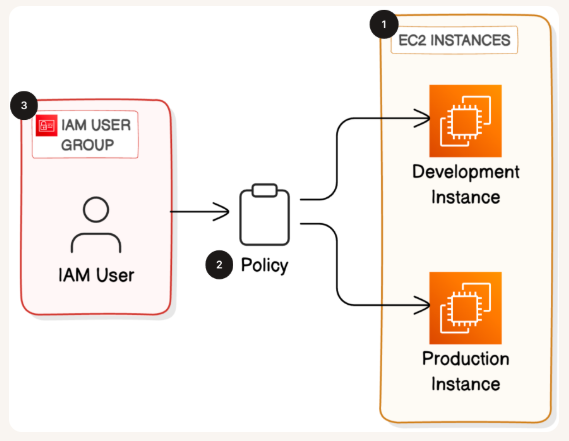
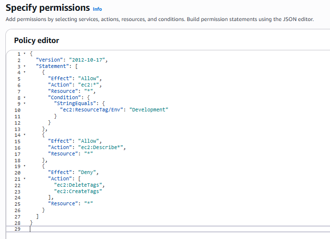
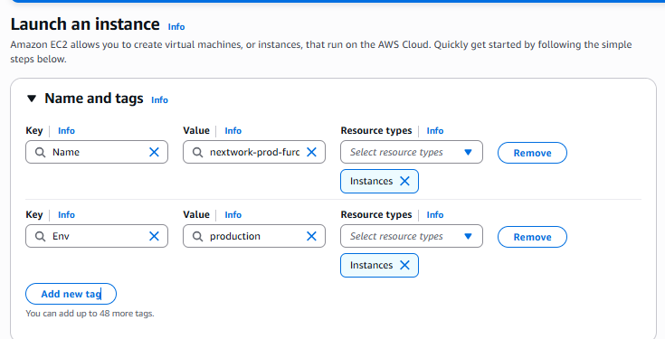
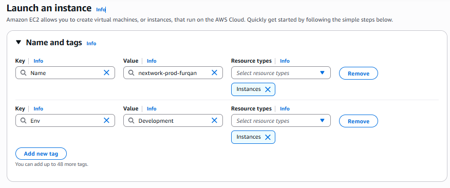

# AWS IAM Tag-Based Access Control for EC2

## Project Overview
This project demonstrates how Identity and Access Management (IAM) policies can be used to enforce **tag-based access control** for EC2 instances.

The goal of this project was to restrict EC2 actions based on resource tags so that users can only manage instances belonging to a specific environment.

This is a common **cloud security practice** used to enforce least privilege access in production environments.

---

## Technologies Used
- AWS EC2
- AWS IAM
- JSON IAM Policies

---

## Architecture

The project consists of:

- Two EC2 instances
- Resource tagging for environment separation
- A custom IAM policy created using the JSON editor

Environment Tags Used:

| Instance | Tag |
|--------|--------|
| Dev Instance | Environment: Development |
| Prod Instance | Environment: Production |

The IAM policy allows EC2 actions **only on resources tagged as Development**.

## Architecture Diagram

The following diagram illustrates how IAM policies enforce tag-based access control for EC2 instances across different environments.

---

## Implementation Steps

### 1. Created EC2 Instances
Two EC2 instances were created in AWS:

- Development Instance
- Production Instance

These instances simulate a typical company environment where development and production workloads are separated.

---

### 2. Applied Resource Tags
Tags were applied to each instance to identify their environment.

Example:

Development Instance
Production Instance

Tags help organizations organize resources and enforce access control policies.

---

### 3. Created Custom IAM Policy

A custom IAM policy was created using the **JSON policy editor**.

Policy behavior:

**Allowed**
- All EC2 actions on instances with tag:

**Denied**
- Creating tags
- Deleting tags

This prevents users from modifying resource tags to bypass security restrictions.

---

### 4. Policy Testing

After attaching the policy to a user/group:

Testing confirmed that:

- Users could control the **Development instance**
- Users could NOT control the **Production instance**
- Tag modification was blocked

This confirms that the tag-based access control policy works as expected.

---

## Security Concepts Demonstrated

This project demonstrates several important cloud security principles:

- Least Privilege Access
- Tag-Based Access Control (TBAC)
- IAM Policy Enforcement
- Environment Isolation
- Resource Governance

These techniques are commonly used in real cloud environments to protect production systems.

---

## Screenshots

### IAM Policy

### EC2 Instance and Tags
### Production Instance

### Development Instance

---

## Project Documentation

A detailed step-by-step report including screenshots, IAM policy explanation, and testing results can be found here:

`Cloud Security with AWS IAM.pdf`

---

## Key Learnings

Through this project I learned:

- How IAM policies control permissions in AWS
- How resource tags can enforce security boundaries
- How to implement tag-based access control
- How to test and validate IAM policy behavior

---

## Author

Muhammad Furqan  
Cybersecurity | Cloud Security | ISO 27001 & SOC 2
